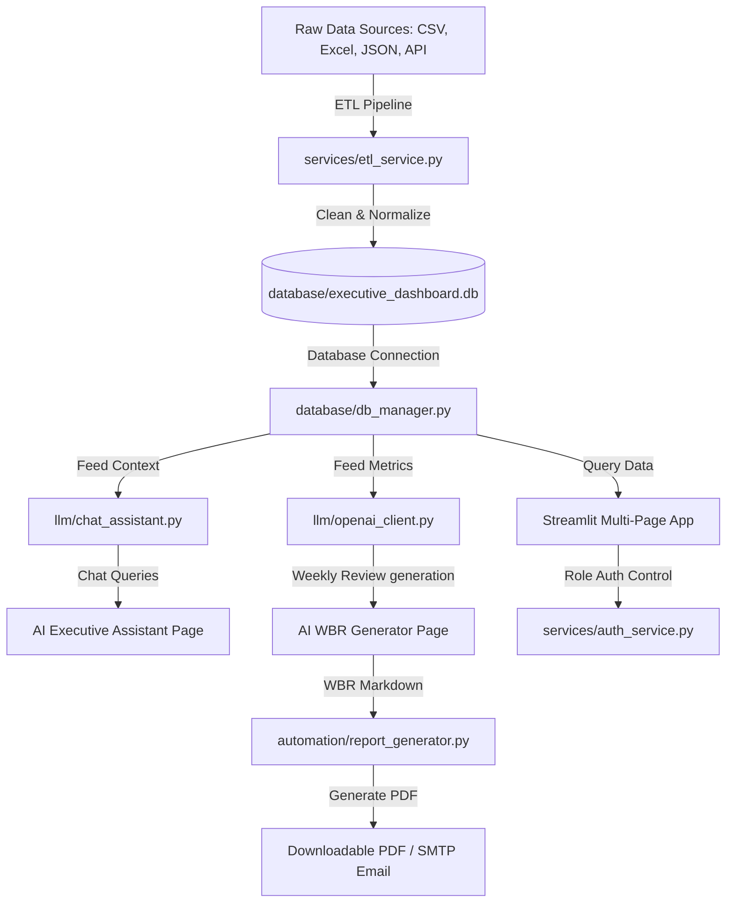

# AI-Powered Executive Dashboard & Business Review Platform

This implementation plan outlines the steps and architecture required to build a production-ready Executive Dashboard and Business Review Automation Platform for a CEO Office.

## User Review Required

> [!IMPORTANT]
> - **OpenAI API Key**: To use the AI WBR Generator and AI Chat Assistant, an OpenAI API Key is required. We will implement a graceful fallback to simulated AI responses if no key is configured, allowing the application to be tested immediately. The API key can be set in a local `.env` file or directly within the application's Admin Settings.
> - **Role-Based Login**: The platform will feature three user roles with default credentials for demonstration:
>   - **CEO** (`ceo` / `ceo123`): Access to all dashboards, WBR generation, and AI Chat Assistant.
>   - **Executive Admin** (`admin` / `admin123`): Access to dashboards, settings, ETL execution, and audit logs.
>   - **Viewer** (`viewer` / `viewer123`): Read-only dashboard access.
> - **Libraries to Install**: We will install `plotly`, `reportlab` (for PDF generation), and `openpyxl` (for Excel reading). These are pure-python libraries and do not require external system installations.

## Open Questions

- *Are there specific SMTP server details you would like to use for the automated email report sending, or should we use a sandbox/simulated email logger by default?* (We will implement a visual simulation of email dispatch inside Streamlit, along with a configuration panel for SMTP if you decide to connect a real mailbox.)
- *Are there specific styling accents or colors you prefer?* (We will default to a premium slate-dark background `#0B0F19` with neon-blue `#38BDF8` and emerald-green `#10B981` glowing highlights to create a high-fidelity dashboard appearance.)

---

## Proposed Architecture

---

## Proposed Changes

### Data Layer & ETL

#### [NEW] [project_details.json](file:///d:/project/data/project_details.json)
This JSON file will contain project descriptions, scope details, and client assignments to expand on the raw `projects.csv`.

#### [NEW] [partner_goals.xlsx](file:///d:/project/data/partner_goals.xlsx)
This Excel file will contain partner targets, lead partner managers, and contract dates to expand on the raw `partners.csv` and demonstrate Excel ingestion.

#### [NEW] [db_manager.py](file:///d:/project/database/db_manager.py)
An OOP Database Manager class using `sqlite3` context managers. It handles:
- Schema initialization and seeding.
- User management and authentication checks (storing password hashes).
- High-performance query abstractions for revenue, projects, workforce, client, and partner data.
- Writing audit logs.

#### [NEW] [schema.sql](file:///d:/project/database/schema.sql)
SQL script defining tables: `users`, `revenue`, `employees`, `partners`, `projects`, `clients`, `api_metrics`, `wbr_reports`, and `audit_logs`.

#### [NEW] [etl_service.py](file:///d:/project/services/etl_service.py)
ETL Pipeline service class. It will:
1. Ingest: Read CSVs, read Excel (`openpyxl`), read JSON (`json`), and fetch simulated global economic benchmarks from a mock REST API service.
2. Clean & Normalize: Parse dates, fill missing values, calculate normalized fields (e.g. YTD Revenue, project delay categorizations, and employee tenure).
3. Load: Write clean, structured data into SQLite.

#### [NEW] [api_service.py](file:///d:/project/services/api_service.py)
Fetches market indexes or global macro metrics from an API endpoint, falling back to cached simulated indicators if network requests fail.

---

### Core Services & Authentication

#### [NEW] [auth_service.py](file:///d:/project/services/auth_service.py)
Handles password hashing (`hashlib.sha256`), session authentication, user profile fetching, role validation, and redirects.

#### [NEW] [openai_client.py](file:///d:/project/llm/openai_client.py)
Wrapper around `openai` client. Handles model completion queries, manages API key checks, formats input system prompts, and handles fallback logic if the API key is missing.

#### [NEW] [chat_assistant.py](file:///d:/project/llm/chat_assistant.py)
Generates natural language answers for the CEO Chat Assistant. It automatically feeds the current database state as JSON context directly to the LLM system prompt, ensuring context-aware, accurate answers.

---

### Components & Styling

#### [NEW] [styles.py](file:///d:/project/components/styles.py)
Houses custom CSS for the dark theme, sidebar styling, glassmorphism cards, and text layout adjustments.

#### [NEW] [kpi_cards.py](file:///d:/project/components/kpi_cards.py)
Streamlit component helper that generates animated HTML markup for KPI cards.

#### [NEW] [charts.py](file:///d:/project/components/charts.py)
Plotly chart generators pre-configured with the slate-dark theme styling, glowing colors, and responsive layouts.

---

### Automation Services

#### [NEW] [report_generator.py](file:///d:/project/automation/report_generator.py)
Generates high-fidelity PDF documents from the WBR markdown report using `ReportLab`. It handles page styling, multi-column tables, headers, footers, and page numbers.

#### [NEW] [email_service.py](file:///d:/project/automation/email_service.py)
Simulates automated SMTP mailing and formats HTML email templates with embedded PDF attachments.

---

### Streamlit Main & Navigation Pages

#### [NEW] [app.py](file:///d:/project/app.py)
The primary entry point. Initializes database, checks session authentication, displays the login screen with custom glassmorphism styling, and defines navigation using `st.navigation`.

#### [NEW] [home.py](file:///d:/project/pages/home.py)
Executive Dashboard Home Page. Displays:
- KPI cards row: Revenue, Growth, Projects (Active/Delayed), Headcount, Partner Pipeline, CSAT/NPS.
- Visual breakdown of project status, quarterly trends, and risk highlights.

#### [NEW] [revenue.py](file:///d:/project/pages/revenue.py)
Revenue Analytics Page. Shows:
- Quarterly & monthly profit/revenue trends.
- Revenue growth forecasts (using sliding average and trend projections).
- Interactive sliders to model forecast horizons and profit margins.

#### [NEW] [projects.py](file:///d:/project/pages/projects.py)
Project Health Page. Displays:
- Budget utilization bar charts.
- Completion percentages vs delay days.
- Dynamic project risk score calculations and risk heatmaps.

#### [NEW] [workforce.py](file:///d:/project/pages/workforce.py)
Workforce Analytics Page. Shows:
- Total active headcount, department distribution, utilization rates, and hiring timeline trends.

#### [NEW] [clients.py](file:///d:/project/pages/clients.py)
Client Insights Page. Highlights:
- NPS and CSAT distributions, client risk indices, and retention statuses.

#### [NEW] [partners.py](file:///d:/project/pages/partners.py)
Partner Pipeline Page. Visualizes:
- Funnel conversions (Qualified -> Negotiation -> Won/Lost), pipeline values, and win rates.
- Partner goals vs actual pipeline values.

#### [NEW] [wbr.py](file:///d:/project/pages/wbr.py)
AI WBR Generator Page.
- Triggers LLM analysis of current SQL metrics.
- Renders the structured 9-point weekly report.
- Provides actions to Export PDF, Send Email, and view/download previously generated reports.

#### [NEW] [chat.py](file:///d:/project/pages/chat.py)
AI Chat Assistant Page.
- Implements a chatbot UI using `st.chat_input` and `st.chat_message`.
- Feeds user questions with database snapshots to the LLM.

#### [NEW] [settings.py](file:///d:/project/pages/settings.py)
System Administration Page. Allows:
- Manual ETL execution triggers.
- Database auditing logs.
- Adding/managing platform users.
- OpenAI API Key configuration.

---

## Verification Plan

### Automated Tests
- Run `python etl_pipeline.py` to test ETL extraction, cleaning, and DB injection.
- Run `streamlit run app.py` locally and verify:
  1. Login page loads and blocks page navigation.
  2. Role redirection works correctly (Viewer, Admin, CEO).
  3. KPI card styling displays glassmorphism blur and animations.
  4. Chatbot correctly parses questions ("Which projects are delayed?") and responds with real database records.
  5. Weekly Business Review successfully generates, downloads as PDF, and logs email delivery.
  6. Plotly charts are fully interactive and filters update displays instantly.

### Manual Verification
- Review PDF layout formatting for consistency and text wrapping.
- Inspect SQLite database tables directly using Python to verify ETL cleanliness.
